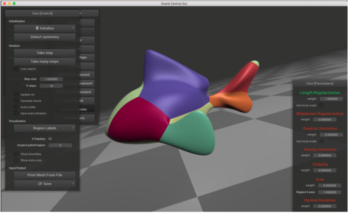

## Welcome to GitHub Pages

You can use the [editor on GitHub](https://github.com/connorzl/3DCutOptimization/edit/master/README.md) to maintain and preview the content for your website in Markdown files.

Whenever you commit to this repository, GitHub Pages will run [Jekyll](https://jekyllrb.com/) to rebuild the pages in your site, from the content in your Markdown files.

### Markdown

Markdown is a lightweight and easy-to-use syntax for styling your writing. It includes conventions for

```markdown
Syntax highlighted code block

# Header 1
## Header 2
### Header 3

- Bulleted
- List

1. Numbered
2. List

**Bold** and _Italic_ and `Code` text

[Link](url) and 
```

For more details see [GitHub Flavored Markdown](https://guides.github.com/features/mastering-markdown/).

## Project Description

### Introduction

3D cut optimization is a problem within computational geometry and computer graphics that deals with flattening 3D objects. Specifically, we are interested in the cuts that should be made to minimize the amount of distortion that occurs when the object is flattened along the cuts into a 2D surface. There are various ways of measuring distortion; one might look at how much the boundaries of each cut patch stretches, or one might also look at the dirichlet distortion term for conformal flattening.

### Project Mentors

For this project, I will be working with professor [**Keenan Crane**](https://www.cs.cmu.edu/~kmcrane/) as my faculty mentor and his PhD student **[Nick Sharp**] (http://nmwsharp.com/). Nick has already been working on the 3D cut optimization problem and is planning to publish a paper on the topic soon. He has been getting me up to speed in the area and part of my research will involve making contributions to his project.

### Current Research

Part of my research project will involve finishing up my current research in 3D cut optimization. Specifically, I am working on supporting compatability between the current cuts-algorithm and real world material fabrication.

```
Current Workflow:

1. Extract all cut patches from the 3D mesh into individual edges
2. Collect edges into individual patches through an algorithm like DFS/Union Find
3. Walk along the edges of each patch and make annotations if an edge and its 'twin' 
   should be placed together
4. Convert to SVG format and perform scaling.
```

Example Input:



### Future Research

### Motivation


